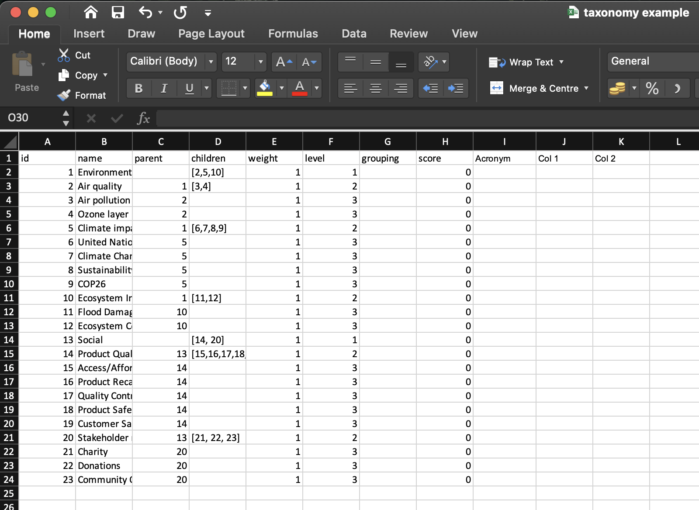

# Taxonomy4Good
<br/><br/>
<p align="center">
    <a href="https://goodbucks.darkm.co/" target="_blank">
       
    </a>
</p>
<br/><br/>
Through the help of academics, professionals, and activists, GOOD DATA HUB has created a sustainability lexicon for terms
used in multiple forms of reporting, social communicative exchange, and other sustainability contexts.


## Table of Content

- [Aim](#aim)
- [What are Taxonomies](#what-are-taxonomies)
- [Use Cases](#use-cases)
- [Installation](#installation)
- [Quick Tour](#quick-tour)
  * [Use existing taxonomy](#use-existing-taxonomy)
  * [Create custom taxonomy](#create-custom-taxonomy)
  * [Get all items and terms](#get-all-items-and-terms)
  * [Update and compute scores](#update-and-compute-scores)
  * [Finding children](#finding-children)
  * [Who is the parent](#who-is-the-parent)
  * [Import your own taxonomy](#import-your-own-taxonomy)
- [Overview of all functions](#overview-of-all-functions)
- [Join the Community](#join-the-community)
- [References](#references)
## Aim
The aim is to bring all facets of sustainable communication in its multiple forms and style into a central place.
The goal of this is to allow everybody to understand how each entity presents their sustainability reporting,
use of words and structure of hierarchy when it comes to representing sustainability. 

## What are Taxonomies
Taxonomy is the practice and science of categorization or classification. A taxonomy (or taxonomical classification) is
a scheme of classification, especially a hierarchical classification, in which things are organised into groups or types.
In this library, we aim to provide organizations, scientists, and activists with a single source of truth to various
listed and non-listed taxonomies. These data structures can be leveraged in several sustainability initiatives such as 
machine learning, NLP and ESG reporting.

## Use Cases

1. The Lexicon as means to centralise Taxonomies of sustainability
   - Often Taxonomies are hard to locate on web search and company pages. We have allowed for the lexicon to be the
   central base for all existing taxonomies and all possible sustainability terms.
   - Taxonomies can be used to understand sustainability practice in certain regions and organisations.
   - Taxonomies can be created to see if the open source community could adopt them and continue to create enriched 
   methods towards sustainability.
2. ML and Topic Modelling
   - Can be utilised in Natural Language Processing and hierarchical topic modelling for creating methods to organise, understand
   and summarise large collections of textual information.
3. Creating and refining Lists of words around impact and sustainability
   - Adding of words to the master taxonomies or updating current taxonomies that can be used for topic modelling around
   sustainability and NLP.
4. Creating custom taxonomies
   - Create new taxonomies that can be adopted by the open source community and inspire new topic models, reporting 
   standards and other sustainability NLP tasks.
5. Scoring and search terms from pre-existing API’s
   - Use the provided taxonomies, or create new ones, to connect with your existing sustainability scoring model. 
   - Search for similar sustainability words/expressions, taxonomies, and even variations of lexicons that preexist in
   the library to query from different APIs

## Installation
You can install sustainability lexicon using the following command:

```
pip install taxonomy4good
```

## Quick Tour

### Use existing taxonomy
To use an existing taxonomy, e.g. `ftse_fsgi`, you can import it directly as follows.
```python
from taxonomy4good import from_file
ftse_builtin_taxonomy = from_file("ftse_fsgi")
```
Here is the list of the current available taxonomies:

| Name                  | Description                                    |
|-----------------------|------------------------------------------------|
| `eu_taxonomy`         | European Union Taxonomy                        |
| `ftse_fsgi`           | FTSE for Social Good Index                     |
| `un_sdg`              | UN Sustainable Development Goals               |
| `world_bank_taxonomy` | World Bank taxonomy                            |
| `china_taxonomy`      | China Taxonomy                                 |
| `esg_taxonomy`        | ESG standard taxonomy                          |
| `en_master_lexicon`   | Structure of the entire sustainability lexicon |

### Create custom taxonomy
You can also create a custom taxonomy from scratch using `SustainabilityItem` objects, then initialize one of the items 
as a root item to a newly created `SustainabilityTaxonomy`.
```python
from taxonomy4good import SustainabilityTaxonomy, SustainabilityItem

root = SustainabilityItem(id=0, name="New Taxonomy")
item1 = SustainabilityItem(id=1, name="item1", parent=root)
item2 = SustainabilityItem(id=2, name="item2", parent=root)
item3 = SustainabilityItem(id=3, name="item3", parent=item1)
item4 = SustainabilityItem(id=4, name="item4", parent=item1)
item5 = SustainabilityItem(id=5, name="item5", parent=item2)
item6 = SustainabilityItem(id=6, name="item6", parent=item2)
root.children = [item1, item2]
item1.children = [item3, item4]
item2.children = [item5, item6]

custom_taxonomy = SustainabilityTaxonomy(root, version_name="Custom Taxonomy")

custom_taxonomy.print_hierarchy()
```
You can see the resulting taxonomy as follows.
```
>>> custom_taxonomy.print_hierarchy()
New Taxonomy : 0
│
│
├─────item1 : 0
│       └───── item3 : 0
│       └───── item4 : 0
└─────item2 : 0
        └───── item5 : 0
        └───── item6 : 0
```
### Get all items and terms
In order to get all the items and terms of the taxonomy, you can use the following lines.
```python
# list of all SustainabilityItem objects
all_items = custom_taxonomy.get_items()

# list of terms (item names)
all_terms = custom_taxonomy.get_terms()
```
The resulting terms are shown in the following snippet.
```
>>> print(all_terms)
['New Taxonomy', 'item1', 'item2', 'item3', 'item4']
```
### Search terms
You can also search for terms by providing a substring. This can help get relevant terms from `en_full_taxonomy`, 
providing you with the most similar sustainability terms that will help query textual data from various APIs and extend 
ML and NLP tasks.
```python
search_result = custom_taxonomy.search_items_by_name("item")
resulting_terms = [result.name for result in search_result]
```
The resulting terms are:
```
>>> print(resulting_terms)
['item1', 'item2', 'item3', 'item4', 'item5', 'item6']
```
### Update and compute scores
Scores and weights can be updated using an external API or imported from an Excel sheet with the taxonomy.
The following is an alternative way to update the scores programmatically
```python
# update scores and weights
# scores and weights can be updated using an API or from Excel
all_items[3].score = 10
all_items[3].weight = 0.3
all_items[4].score = 23
all_items[4].weight = 0.7
all_items[5].score = 7.4
all_items[5].weight = 0.5
all_items[6].score = -13
all_items[6].weight = 0.5

# compute score
root_score = custom_taxonomy.compute_scores()
```
We can the result of the updates in the following snippet.
```
>>> print(root_score)

16.299999999999997

>>> custom_taxonomy.print_hierarchy()

New Taxonomy : 16.299999999999997
│
│
├─────item1 : 19.099999999999998
│       └───── item3 : 10
│       └───── item4 : 23
└─────item2 : -2.8
        └───── item5 : 7.4
        └───── item6 : -13
```
### Finding children
```python
root_children = all_items[0].children
root_children_names = [child.name for child in root_children]
```

```
>>> print(root_children_names)
['item1', 'item2']
```
### Who is the parent
```python
item_parent = all_items[1].parent
```

```
>>> print(item_parent.name)
New Taxonomy
```

### Import your own taxonomy
You can create your own taxonomy on Excel and make use and make use of the provided data structure `SustainabilityTaxonomy`.
The items of this data structure must include the following columns (attributes): `id`,`name`,`level`, `grouping`,
 `parent`,`score`, `weight`,`children`. Any other columns will be aggregated inside a dictionary called `meta_data`.\
Feel free to enrich your taxonomy with additional attributes!\
The following is an example Excel file that is filled manually to provide a custom taxonomy.
<p align="center">
   
</p>

The columns `Acronym`, `Col 1`, and `Col 2` will be included in the attribute `meta_data` of the resulting 
`SustainabilityTaxonomy` object, as shown below.

```python
from taxonomy4good import from_file

example = from_file("examples/taxonomy example.xlsx", filetype="excel", meta=True)
```
The resulting taxonomy can be printed as follows.
```
>>> example.print_hierarchy()
Standard Taxonomy : 0
│
│
├─────Environment : 0
│       └───── Air quality : 0
│              └───── Air pollution : 0
│              └───── Ozone layer : 0
│       └───── Climate impacts : 0
│              └───── United Nations Climate Change Conference : 0
│              └───── Climate Change : 0
│              └───── Sustainability Accounting Standards Board : 0
│              └───── COP26 : 0
│       └───── Ecosystem Impacts : 0
│              └───── Flood Damage : 0
│              └───── Ecosystem Conservation : 0
└─────Social : 0
        └───── Product Quality and Safety : 0
               └───── Access/Affordability : 0
               └───── Product Recall : 0
               └───── Quality Control : 0
               └───── Product Safety : 0
               └───── Customer Satisfaction : 0
        └───── Stakeholder relations : 0
               └───── Charity : 0
               └───── Donations : 0
               └───── Community Outreach : 0
```
To check what are the different attributes of a certain item you can search for the item by `id` or by `name` as follows.
```python
social_item = example.search_items_by_name("Social")[0]
```
or
```python
social_item = example.search_by_id(13)[0]
```
Printing the details of a certain `SustainabilityItem` object works as follows.
```
>>> social_item.details()
name: Social
id: 13
level: 1
children: [14, 20]
parent: 0
score: 0
weight: 1
meta_data: {'Acronym': None, 'Col 1': None, 'Col 2': None}
```
Note how `meta_data` stored the additional columns introduced in the Excel file.
## Overview of all functions

| Function                                             | Description                                                                                 |
|------------------------------------------------------|---------------------------------------------------------------------------------------------|
| `insert_items(items)`                                | Insert additional items (terms/lexicons) to this existing taxonomy                          |
| `remove_subtree(items)`                              | Remove the passed items along with their children from the taxonomy                         |
| `remove_by_id(ids)`                                  | Remove from the taxonomy items corresponding to the supplied ids                            |
| `get_items_each_level(start_root)`                   | Get lists of items for each level of the taxonomy (grouped by level)                        |
| `get_level_items(level)`                             | Get items of the specified level                                                            |
| `get_items(start_root)`                              | Get all the items of the structure                                                          |
| `get_terms(start_root)`                              | Get all terms (names/lexicon) in the taxonomy                                               |
| `get_all_ids(start_root)`                            | Get ids of all the nodes in the current taxonomy (grouped by level)                         |
| `search_by_id(ids)`                                  | Search for items by their id                                                                |
| `level(start_item)`                                  | Compute the maximum depth/level of the taxonomy                                             |
| `to_csv(filepath, start_root)`                       | Save current taxonomy/substructure to a csv file                                            |
| `to_excel(filepath, start_root)`                     | Save current taxonomy/substructure to an Excel file                                         |
| `items_to_json(filepath, start_root)`                | Save current taxonomy/substructure items to a JSON file (records structure)                 |
| `taxonomy_to_json(filepath, start_root)`             | Save current taxonomy/substructure items to a JSON file (hierarchical structure)            |
| `print_hierarchy(start_item, current_level, islast)` | Print the current hierarchy of the taxonomy with the respective values                      |
| `get_level_scores(level)`                            | Compute the weighted values/scores for the specified level                                  |
| `compute_scores(start_root, root_score)`             | Compute the weighted scores for the entire taxonomy                                         |
| `summary()`                                          | Print the general information about the entire taxonomy                                     |
| `to_dataframe(start_root)`                           | Convert the entire taxonomy to a DataFrame                                                  |
| `similar_items(sustainability_items)`                | Gives the items under the same parent                                                       |
| `similar_items_byid(ids)`                            | Gives the items under the same parent as items having the specified ids                     |
| `search_items_by_name(terms, start_root)`            | Look for similar SustainabilityItems using a string partial match                           |
| `search_similar_names(terms, start_root)`            | Search for similar names/terms in the taxonomy using a string partial match                 |
| `items_to_dict(start_root)`                          | Convert the entire taxonomy to a dictionary (records) starting from start_root              |
| `taxonomy_to_dict(start_root)`                       | Convert the entire taxonomy to a dictionary (structural hierarchy) starting from start_root |

## Join the Community
Join our slack community to start collaborating and exchanging with GOOD DATA HUB team, data scientists and sustainability
specialists!


